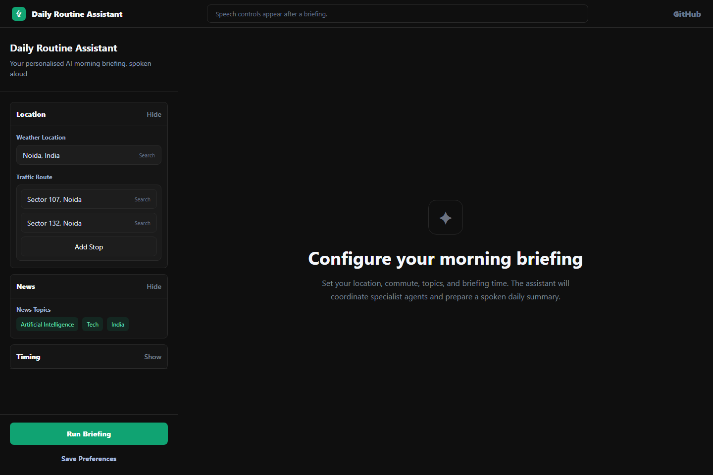
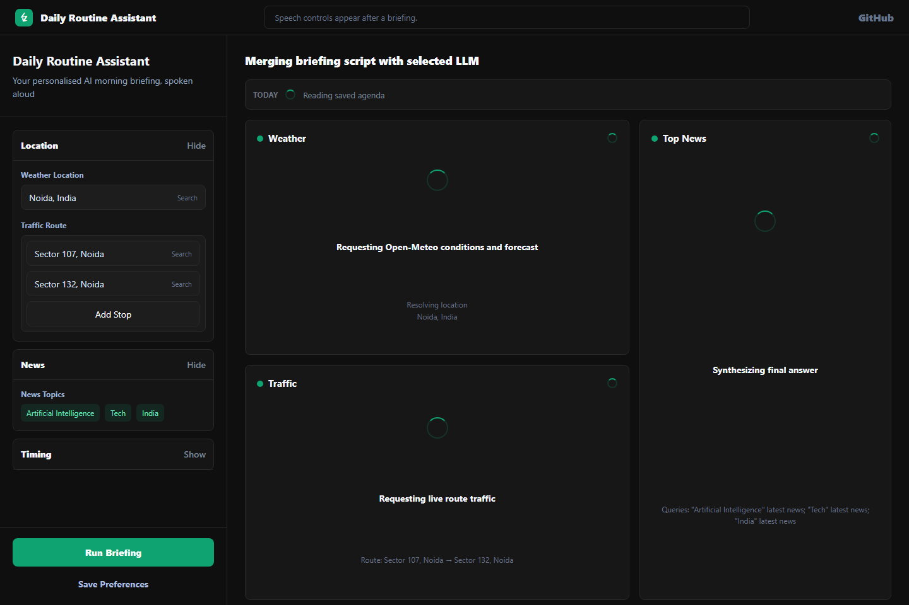
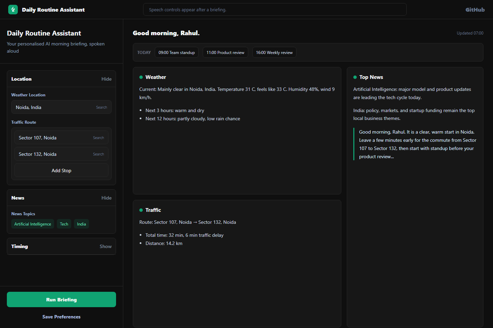

# Daily Routine Assistant

Your personalised AI morning briefing, spoken aloud in the browser. Four specialist agents run in parallel to gather weather, news, traffic, and schedule context; then an LLM merges everything into one coherent briefing script for browser Web TTS.


## Screenshots







## Features

- Parallel weather, news, traffic, and schedule agents.
- Streaming progress updates while each agent works.
- Spoken briefing playback through the browser Web Speech API.
- Configurable commute route, location, news topics, agenda, and briefing times.
- Pluggable LLM providers: OpenAI, OpenRouter, Gemini, and Ollama.
- APScheduler support for automatic briefings at configured times.
- Graceful fallback behavior when one data source is unavailable.

## Demo Flow

1. Configure your location, route, topics, and briefing times in the sidebar.
2. Save preferences to `backend/user_config.yaml`.
3. Click **Run Briefing** or call the backend API.
4. Watch the weather, traffic, news, and schedule agents stream progress.
5. Read or listen to the final merged morning briefing in the browser.

## What Makes It Agentic

- The workflow is decomposed into independent agents with focused responsibilities instead of one large prompt.
- LangGraph coordinates parallel execution, convergence, and final synthesis.
- Each agent owns a separate external tool or context source: DuckDuckGo news search, Open-Meteo weather, TomTom traffic, and local schedule config.
- The merger agent reasons over multiple partial results and produces a single user-facing briefing.
- The system degrades gracefully: failed sources return warnings while successful agents still contribute to the final response.

## Tech Stack

| Layer | Tools |
|---|---|
| Backend | FastAPI, LangGraph, Pydantic, APScheduler |
| Frontend | React, Vite, Tailwind CSS |
| Data sources | Open-Meteo, DuckDuckGo, TomTom |
| LLM providers | OpenAI, OpenRouter, Gemini, Ollama |
| Config | YAML, python-dotenv |
| Speech | Browser Web Speech API |

## Architecture

```
Client / scheduler
        |
        | POST /run, POST /run/stream, GET/POST /config
        v
+-----------------------------+
| FastAPI backend             |
| backend/main.py             |
+-------------+---------------+
              |
              | invokes graph
              v
+-----------------------------+
| LangGraph workflow          |
| backend/graph.py            |
+-------------+---------------+
              |
              | runs agents in parallel
              v
+-------------+   +---------------+   +---------------+   +----------------+
| news_agent  |   | weather_agent |   | traffic_agent |   | schedule_agent |
| DuckDuckGo  |   | Open-Meteo    |   | TomTom        |   | user_config    |
+------+------+   +-------+-------+   +-------+-------+   +--------+-------+
       |                  |                   |                    |
       +------------------+-------------------+--------------------+
                          |
                          | merge sections
                          v
                  +------------------+
                  | merger.py        |
                  | LLM synthesis    |
                  +--------+---------+
                           |
                           | briefing script + sections
                           v
                  +------------------+
                  | React frontend   |
                  | Web Speech API   |
                  +------------------+

APScheduler can trigger the same graph automatically at configured briefing times.
```

## Project Structure

```text
backend/
  main.py                 FastAPI routes and streaming endpoint
  graph.py                LangGraph orchestration
  scheduler.py            APScheduler setup
  config.py               env + YAML config loader
  nodes/
    news_agent.py
    weather_agent.py
    traffic_agent.py
    schedule_agent.py
    merger.py
frontend/
  src/
    App.jsx
    api/
    components/
doc/screenshots/
  landing-page.png
  app-working.png
  app-response.png
```

## Quick Start

Terminal 1 - backend:

```bash
cd backend
python -m venv .venv
.venv\Scripts\activate
pip install -r requirements.txt
copy .env.example .env
copy user_config.example.yaml user_config.yaml
cd ..
backend\.venv\Scripts\python.exe -m uvicorn backend.main:app --reload --host 127.0.0.1 --port 8000
```

Terminal 2 - frontend:

```bash
cd frontend
npm install
npm run dev
```

Open the frontend at `http://localhost:5173`.

## Setup

### 1. Backend

```bash
cd backend
python -m venv .venv
# Windows:
.venv\Scripts\activate
# macOS/Linux:
source .venv/bin/activate

pip install -r requirements.txt

cp .env.example .env
# Fill in your API keys in .env

cp user_config.example.yaml user_config.yaml
# Edit user_config.yaml with your name, location, topics, schedule

uvicorn backend.main:app --reload --port 8000
# or, from the project root:
backend\.venv\Scripts\python.exe -m uvicorn backend.main:app --reload --host 127.0.0.1 --port 8000
```

Run uvicorn from the project root when using `backend.main:app` so that `from backend.xxx import ...` imports resolve correctly.

### 2. Frontend

```bash
cd frontend
npm install
npm run dev        # http://localhost:5173
```

## API Keys Needed

| Key | Where to get | Required for |
|---|---|---|
| `LLM_PROVIDER` | env setting | `openai` \| `openrouter` \| `gemini` \| `ollama` |
| `LLM_MODEL` | env setting | Model name passed to the selected LLM provider |
| `OPENAI_API_KEY` | platform.openai.com | LLM, if using OpenAI |
| `OPENROUTER_API_KEY` | openrouter.ai | LLM, if using OpenRouter |
| `OPENROUTER_BASE_URL` | optional override | Defaults to `https://openrouter.ai/api/v1` |
| `OPENROUTER_APP_NAME`, `OPENROUTER_SITE_URL` | optional metadata | Sent as OpenRouter request headers |
| `GEMINI_API_KEY` | aistudio.google.com | LLM, if using Gemini |
| `TOMTOM_API_KEY` | developer.tomtom.com | Traffic agent |

Notes:

- Weather uses Open-Meteo and does not require an API key.
- Traffic route quality is best with `TOMTOM_API_KEY`.
- The final natural-language briefing needs a configured LLM provider; if the merger call fails, the backend falls back to concatenating available sections.
- Speech uses the browser Web Speech API. There is no backend TTS service or TTS API key.

## Configuration

### `user_config.yaml` field reference

| Field | Description |
|---|---|
| `user_name` | Your first name, used in the greeting |
| `location` | City + country for weather and traffic, for example `"Noida, India"` |
| `timezone` | IANA timezone, for example `"Asia/Kolkata"` |
| `topics` | News topics used for DuckDuckGo lookup |
| `traffic_from` | Starting point for commute traffic |
| `traffic_to` | Destination for commute traffic |
| `traffic_stops` | Optional intermediate stops |
| `briefing_time` | Legacy first briefing time, kept for older clients |
| `briefing_times` | List of 24-hour `HH:MM` times when APScheduler fires daily |
| `agenda.<weekday>` | List of `"HH:MM - description"` strings for that day |

### Switching LLM Provider

Edit `.env` and restart the backend:

```env
LLM_PROVIDER=your_provider
LLM_MODEL=your_model
OPENROUTER_API_KEY=your_key_if_using_openrouter
```

LLM provider and model are environment-level settings. They are not changed from the UI or `POST /config`.

## How It Works

Daily Routine Assistant reads saved preferences from `backend/user_config.yaml`, then runs a LangGraph workflow that fans out into four specialist agents: weather, news, traffic, and schedule. Each agent gathers or formats its own data, returns a structured briefing section, and hands that section back to the graph.

After the parallel agents finish, `backend/nodes/merger.py` asks the configured LLM provider to turn the sections into a short, natural spoken briefing. The React frontend calls `/run/stream`, displays incremental progress card by card, and uses the browser Web Speech API to read the final briefing aloud.

## Use Cases

- Personal morning briefing before work.
- Commute planning with live route context.
- Daily prep assistant for meetings and topic monitoring.
- Starter template for multi-agent dashboard applications.
- Example project for LangGraph orchestration with a React UI.

## Key Technical Highlights

- FastAPI backend with `/run`, `/run/stream`, `/config`, location search, and traffic-location search endpoints.
- Streaming newline-delimited JSON events for live frontend progress updates.
- LangGraph state machine for parallel agent orchestration.
- Pluggable LLM provider support for OpenAI, OpenRouter, Gemini, and Ollama.
- APScheduler support for automatic daily briefings at one or more configured times.
- React + Tailwind frontend with editable preferences, progress traces, copy support, and browser-native speech playback.
- YAML-backed user preferences for location, topics, commute route, briefing times, and weekday agenda.

## Sample Query / Response

Manual trigger:

```bash
curl -X POST http://127.0.0.1:8000/run
```

Example response shape:

```json
{
  "greeting": "Good morning, Rahul.",
  "sections": [
    {
      "type": "weather",
      "title": "Weather",
      "content": "Current: Clear sky in Noida, India. Temperature 31 C, feels like 33 C..."
    },
    {
      "type": "traffic",
      "title": "Traffic",
      "content": "Route: Sector 107, Noida -> Sector 132, Noida. Total time: 32 min..."
    },
    {
      "type": "news",
      "title": "Top News",
      "content": "Artificial Intelligence: ..."
    }
  ],
  "briefing_script": "Good morning, Rahul. It is clear in Noida today...",
  "errors": [],
  "trace": [
    "Started briefing run",
    "Collected weather, news, traffic, and schedule inputs",
    "Prepared spoken briefing script"
  ]
}
```

## Adapting This For A New Project

This frontend is built on a reusable template. To clone it for a different agent project:

1. Copy the `frontend/` folder.
2. Edit `frontend/src/config.js` to change the name, accent colour, and labels.
3. Replace `InputPanel.jsx` with your own form fields.
4. Replace `OutputPanel.jsx` success content with your result renderer.
5. Update `frontend/src/api/agent.js` endpoint paths.

## Limitations

- Live weather, news, and traffic quality depends on third-party APIs and network availability.
- TomTom traffic requires an API key; without it, traffic falls back to web search or an unavailable-data message.
- Browser speech playback depends on the user's browser voices and Web Speech API support.
- The scheduler runs with the backend process, so scheduled briefings require the backend to stay online.
- The default CORS policy is permissive for local development and should be tightened before production deployment.

## License

This project is licensed under the MIT License. See the `LICENSE` file for details.

## Roadmap

- Add authentication and per-user profiles for hosted deployments.
- Persist briefing history so users can revisit previous morning summaries.
- Add richer calendar integrations beyond static YAML agenda entries.
- Add production deployment docs for Docker, cloud hosting, and environment setup.
- Improve observability with structured logs and a trace viewer for each agent run.
